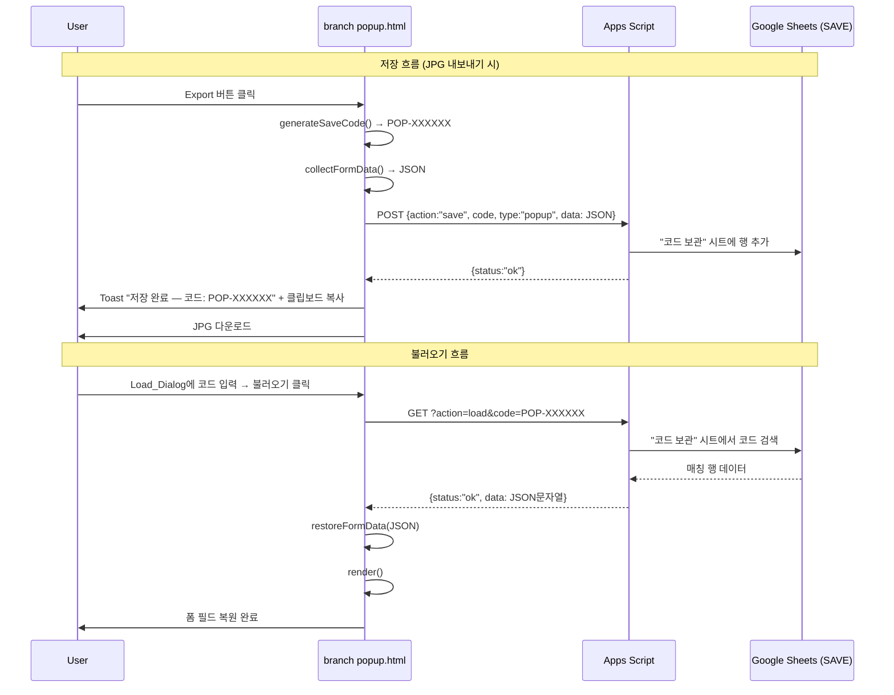

# Design Document: Save/Load Popup

## Overview

점별 팝업 행사 생성기(`pages/branch popup.html`)에 저장/불러오기 기능을 추가한다. JPG 내보내기 시 고유 코드(`POP-XXXXXX`)를 생성하고, 모든 텍스트 입력값을 Google Sheets의 "코드 보관" 시트에 JSON으로 저장한다. 이후 코드를 입력하면 저장된 데이터를 불러와 폼을 복원할 수 있다. 부가적으로 인라인 Base64 폰트를 외부 CSS로 분리하여 파일 경량화를 수행한다.

### Design Decisions

- **클라이언트 사이드 코드 생성**: Save_Code는 브라우저에서 `crypto.getRandomValues()`로 생성한다. 서버 왕복 없이 즉시 코드를 확보할 수 있고, 6자리 영숫자(36^6 ≈ 21억)로 충돌 확률이 극히 낮다.
- **기존 Apps Script 확장**: 새 파일을 만들지 않고 `apps_script.gs`에 `action` 파라미터 분기를 추가한다. 기존 `doPost`의 DATA 시트 기록은 그대로 유지하고, `action: "save"` 시 "코드 보관" 시트에 기록하는 분기를 추가한다.
- **이미지 제외**: Base64 이미지 데이터는 Google Sheets 셀 크기 제한(50,000자)을 초과할 수 있으므로 Form_Data에서 제외한다. 텍스트 필드만 저장/복원한다.
- **폰트 분리**: `static/css/maison-neue.css`에 `@font-face` 선언을 이동하고, `branch popup.html`에서 `<link>` 태그로 참조한다. 기존 `static/css/fonts.css`에 이미 동일 폰트가 있으므로, 해당 파일을 재활용하거나 새 파일로 분리한다.

## Architecture



## Components and Interfaces

### 1. Save_Code Generator (클라이언트)

`branch popup.html` 내 `<script>` 블록에 추가하는 함수.

```javascript
function generateSaveCode() {
  const chars = 'ABCDEFGHIJKLMNOPQRSTUVWXYZ0123456789';
  const arr = new Uint8Array(6);
  crypto.getRandomValues(arr);
  let code = 'POP-';
  for (let i = 0; i < 6; i++) code += chars[arr[i] % 36];
  return code;
}
```

### 2. Form_Data Collector / Restorer (클라이언트)

```javascript
// 수집
function collectFormData() {
  return {
    brand: v('f-brand'),
    title: v('f-title'),
    period: v('f-period'),
    loc: v('f-loc'),
    headerBg: headerBg,
    intro: v('f-intro'),
    notes: v('f-notes'),
    items: items.map(it => ({ name: it.name, price: it.price, desc: it.desc })),
    benefits: bns.map(bn => ({ cond: bn.cond, gift: bn.gift }))
  };
}

// 복원
function restoreFormData(data) {
  document.getElementById('f-brand').value = data.brand || '';
  document.getElementById('f-title').value = data.title || '';
  document.getElementById('f-period').value = data.period || '';
  document.getElementById('f-loc').value = data.loc || '';
  if (data.headerBg) applyColor(data.headerBg, '', '');
  document.getElementById('f-intro').value = data.intro || '';
  document.getElementById('f-notes').value = data.notes || '';

  // Items 재생성
  items = []; iIdx = 0;
  (data.items || []).forEach(it => {
    const id = ++iIdx;
    items.push({ id, img: null, name: it.name, price: it.price, desc: it.desc });
  });
  rebuildItems();

  // Benefits 재생성
  bns = []; bIdx = 0;
  (data.benefits || []).forEach(bn => {
    const id = ++bIdx;
    bns.push({ id, img: null, cond: bn.cond, gift: bn.gift });
  });
  rebuildBns();

  render();
}
```

### 3. Load_Dialog UI (클라이언트)

Form_Panel 상단(`sec` 블록 이전)에 삽입하는 HTML 블록:

```html
<div class="load-bar">
  <input type="text" id="load-code" placeholder="POP-XXXXXX" maxlength="10" />
  <button id="load-btn" onclick="doLoad()">불러오기</button>
</div>
```

### 4. doExport 수정 (클라이언트)

기존 `doExport()` 함수에 Save_Code 생성 → Form_Data 수집 → POST 전송 → Toast/클립보드 로직을 추가한다. JPG 다운로드 로직은 그대로 유지하되, POST 실패 시에도 다운로드는 진행한다.

### 5. Apps Script API 확장 (서버)

`apps_script.gs`의 `doPost`와 `doGet`을 확장한다.

```javascript
// doGet 확장 — action=load 처리
function doGet(e) {
  var action = (e.parameter && e.parameter.action) || '';
  if (action === 'load') {
    return handleLoad(e.parameter.code);
  }
  // 기존 동작 유지
  return ContentService.createTextOutput('Apps Script 정상 작동 중')
    .setMimeType(ContentService.MimeType.TEXT);
}

// doPost 확장 — action 분기
function doPost(e) {
  try {
    var data = JSON.parse(e.postData.contents);
    if (data.action === 'save') {
      return handleSave(data);
    }
    // 기존 DATA 시트 기록 로직 유지
    // ...
  } catch (err) { /* ... */ }
}
```

## Data Models

### Save_Sheet 구조 (Google Sheets "코드 보관" 시트)

| 열 | 헤더 | 타입 | 설명 |
|---|---|---|---|
| A | 코드 | String | `POP-XXXXXX` 형식 |
| B | 콘텐츠 유형 | String | popup, anniversary, newopen, sale 중 하나 |
| C | 데이터 | String | Form_Data JSON 문자열 (불러오기 복원용) |
| D | 생성 시간 | String | `yyyy-MM-dd HH:mm:ss` (Asia/Seoul) |

### Form_Data JSON Schema

```json
{
  "brand": "string",
  "title": "string",
  "period": "string",
  "loc": "string",
  "headerBg": "#XXXXXX",
  "intro": "string",
  "notes": "string",
  "items": [
    { "name": "string", "price": "string", "desc": "string" }
  ],
  "benefits": [
    { "cond": "string", "gift": "string" }
  ]
}
```

### Save_Code 형식

- 패턴: `POP-[A-Z0-9]{6}`
- 예시: `POP-A3X7K2`, `POP-9BZ4M1`
- 생성: 클라이언트 `crypto.getRandomValues()` 기반

## Correctness Properties

*A property is a characteristic or behavior that should hold true across all valid executions of a system — essentially, a formal statement about what the system should do. Properties serve as the bridge between human-readable specifications and machine-verifiable correctness guarantees.*

### Property 1: Save_Code format validity

*For any* generated Save_Code, the code SHALL match the regex pattern `^POP-[A-Z0-9]{6}$` — exactly the prefix "POP-" followed by 6 uppercase alphanumeric characters.

**Validates: Requirements 1.1**

### Property 2: Form_Data round-trip preservation

*For any* valid Form_Data object (containing arbitrary strings for brand, title, period, loc, headerBg, intro, notes, and arbitrary-length lists of items and benefits), calling `collectFormData()` after `restoreFormData(data)` SHALL produce an object deeply equal to the original data.

**Validates: Requirements 2.1, 3.4, 4.1, 4.2, 4.3, 4.4, 4.5, 4.6**

## Error Handling

| 시나리오 | 처리 |
|---|---|
| POST 저장 실패 (네트워크 오류) | "저장 실패" Toast 표시, JPG 다운로드는 정상 진행 |
| GET 불러오기 실패 (네트워크 오류) | "불러오기 실패. 네트워크를 확인해 주세요" Toast 표시 |
| Save_Code 미존재 (not_found 응답) | "해당 코드의 저장 데이터가 없습니다" Toast 표시 |
| Apps Script 서버 오류 | `{ status: "error", msg: "..." }` JSON 응답 반환 |
| "코드 보관" 시트 미존재 | Apps Script가 첫 요청 시 자동 생성 + 헤더 행 추가 |
| Form_Data JSON 파싱 실패 | 클라이언트에서 try-catch 후 "데이터 형식 오류" Toast 표시 |
| 빈 Save_Code 입력 | 불러오기 버튼 클릭 시 입력값 검증, 빈 값이면 무시 |

## Testing Strategy

### Property-Based Tests (fast-check)

이 프로젝트는 브라우저 기반 JavaScript이므로, `fast-check` 라이브러리를 사용하여 property-based testing을 수행한다.

- 최소 100회 반복 실행
- 각 테스트에 설계 문서의 Property 번호를 태그로 기록
- 태그 형식: `Feature: save-load-popup, Property {N}: {description}`

**Property 1 테스트**: `generateSaveCode()`를 100회 이상 호출하여 모든 결과가 `^POP-[A-Z0-9]{6}$` 패턴에 매칭되는지 검증.

**Property 2 테스트**: `fast-check`로 임의의 Form_Data 객체(문자열 필드, 가변 길이 items/benefits 배열)를 생성하고, `restoreFormData()` → `collectFormData()` 라운드트립 후 원본과 동일한지 검증. DOM 모킹(jsdom) 필요.

### Unit Tests (Example-Based)

- Save_Code가 Toast에 표시되는지 (1.2)
- Save_Code가 클립보드에 복사되는지 (1.3)
- 재내보내기 시 새 코드가 생성되는지 (1.4)
- Load_Dialog UI 요소 존재 여부 (3.1)
- 불러오기 중 버튼 비활성화/복원 (3.3, 3.7)
- render() 호출 여부 (4.7)
- 외부 CSS link 태그 존재 여부 (7.2)

### Edge Case Tests

- POST 저장 실패 시 Toast + JPG 다운로드 정상 진행 (2.4)
- 코드 미존재 시 "not_found" Toast (3.5)
- GET 실패 시 "불러오기 실패" Toast (3.6)

### Integration Tests

- Apps Script POST save → "코드 보관" 시트 행 추가 확인 (2.3)
- Apps Script GET load → 올바른 JSON 응답 확인 (5.1, 5.2)
- Apps Script GET load 미존재 코드 → not_found 응답 (5.3)
- Apps Script 오류 시 error 응답 (5.4)

### Smoke Tests

- "코드 보관" 시트 자동 생성 확인 (6.1, 6.2)
- "코드 보관" 시트 헤더 컬럼 구조 확인 (6.3)
